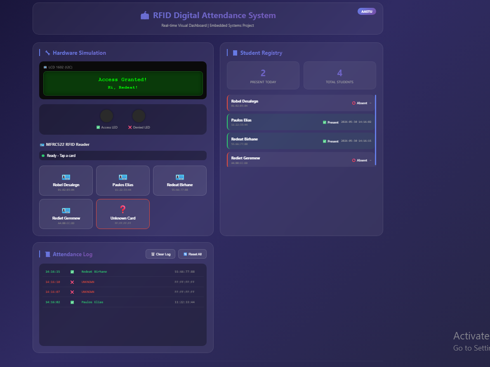

# 🏫 RFID Digital Attendance System

## Real-time Visual Dashboard | Embedded Systems Project

---

## 📋 Overview

The **RFID Digital Attendance System** is a complete attendance tracking solution that simulates RFID-based access control. This project consists of two main components:

1. **Hardware Simulation (Wokwi)** – Arduino-based simulation of RFID reader, LCD display, LEDs, and RTC.
2. **Visual Dashboard (Node.js + Express)** – Real-time web interface that visually represents the entire system.

The system allows students to "tap" RFID cards (simulated via on-screen buttons), which:

* Displays personalized greetings on the LCD
* Flashes green/red LEDs based on access status
* Logs every attendance event with timestamps
* Maintains a real-time attendance registry

---

## 👥 Team Members

| ID      | Name              |
| ------- | ----------------- |
| 0877/11 | Paulos Elias      |
| 1127/15 | Rebika Weldeyesus |
| 1130/15 | Redeat Birhane    |
| 1137/15 | Rediet Geremew    |
| 1157/15 | Robel Desalegn    |

**Course:** Embedded Systems
**Instructor:** Kassahun Tadesse
**University:** Addis Ababa Science & Technology University
**Academic Year:** 2025/26, Semester II

---

## 🚀 Features

### Hardware Simulation (Wokwi)

* ✅ MFRC522 RFID card reader simulation
* ✅ LCD 1602 display with I2C interface
* ✅ DS1307 Real-Time Clock for accurate timestamps
* ✅ Green/Red LED indicators for access feedback
* ✅ Four registered students with unique UIDs
* ✅ Serial logging of all events

### Visual Dashboard (Node.js)

* ✅ Real-time LCD emulator matching hardware output
* ✅ Visual RFID cards represented by clickable buttons
* ✅ Animated LED indicators
* ✅ Live student attendance registry
* ✅ Attendance log with timestamps
* ✅ Real-time updates using Socket.io
* ✅ Reset attendance functionality
* ✅ Log export and storage

---

## 🛠️ Technologies Used

| Component               | Technology                     |
| ----------------------- | ------------------------------ |
| Hardware Simulation     | Arduino, C++                   |
| Simulation Platform     | Wokwi                          |
| Backend                 | Node.js, Express.js            |
| Real-Time Communication | Socket.io                      |
| Frontend                | HTML5, CSS3, JavaScript        |
| UI Design               | CSS3, Glassmorphism, Gradients |

---

## 📁 Project Structure

```text
attendance_dashboard/
├── server.js
├── package.json
├── public/
│   ├── index.html
│   └── style.css
├── attendance_log.txt
└── README.md

Wokwi Simulation/
├── arduino_code.ino
└── wokwi_project.json
```

---

## 🔧 Installation & Setup

### Prerequisites

* Node.js (v14 or higher)
* Modern web browser (Chrome, Firefox, Edge)
* Internet connection for initial dependency installation

### Step 1: Download the Project

Clone or download the project files to your local machine.

### Step 2: Install Dependencies

```bash
npm install
```

### Step 3: Start the Application

```bash
npm start
```

### Step 4: Open the Dashboard

Visit:

```text
http://localhost:3000
```

---

## 🎮 How to Use

### Dashboard Controls

| Control       | Action                   |
| ------------- | ------------------------ |
| Student Cards | Simulate RFID card tap   |
| Unknown Card  | Test unauthorized access |
| Reset All     | Clear attendance records |
| Clear Log     | Remove attendance logs   |

### Demonstration Flow

#### Valid Card Scan

1. Click a registered student card.
2. LCD displays:

```text
Access Granted!
Hi, Robel!
```

3. Green LED flashes.
4. Attendance is recorded.
5. Student status becomes **Present**.

#### Repeat Scan

```text
Welcome Back!
Robel ✓
```

No duplicate attendance entry is created.

#### Unknown Card Scan

```text
Access Denied!
Unknown Card
```

* Red LED flashes.
* Access denial is logged.

---

## 📊 System Flow Diagram

```text
┌─────────────────┐
│ User taps card  │
│ (click button)  │
└────────┬────────┘
         ▼
┌─────────────────┐
│ Server receives │
│ card UID        │
└────────┬────────┘
         ▼
┌─────────────────┐
│ Lookup student  │
│ in registry     │
└────────┬────────┘
         ▼
    ┌────┴────┐
    ▼         ▼
 Known      Unknown
 Card        Card
    ▼         ▼
Grant      Deny
Access     Access
    ▼         ▼
Update    Red LED
Log       Log Event
Green LED
```

---

## 🔌 Wokwi Simulation

Wokwi Project Link:

https://wokwi.com/projects/461212710331223041

**Note:** The simulation uses predefined RFID card UIDs due to platform limitations.

---

## 📝 Registered Students & Card UIDs

| Student Name      | Card UID    |
| ----------------- | ----------- |
| Robel Desalegn    | 01:02:03:04 |
| Paulos Elias      | 11:22:33:44 |
| Redeat Birhane    | 55:66:77:88 |
| Rediet Geremew    | AA:BB:CC:DD |
| Unknown Test Card | FF:FF:FF:FF |

---

## 🎯 Applications

* Classroom attendance systems
* Employee attendance tracking
* Event registration systems
* Laboratory access monitoring
* Smart access control solutions

---

## 📸 Screenshots

### Dashboard View

```markdown
![Dashboard Screenshot]

```

*Dashboard showing LCD emulator, RFID controls, attendance registry, and activity log.*

---

## 🚦 API Endpoints

| Endpoint         | Method | Description                    |
| ---------------- | ------ | ------------------------------ |
| `/api/status`    | GET    | Retrieve current system status |
| `/api/tap`       | POST   | Simulate RFID card tap         |
| `/api/reset`     | POST   | Reset attendance records       |
| `/api/clear_log` | POST   | Clear attendance log           |

### Example Request

```json
{
  "card_id": "01:02:03:04"
}
```

---

## 🔮 Future Improvements

* [ ] Live communication with physical RFID hardware
* [ ] MongoDB/PostgreSQL integration
* [ ] Administrative authentication system
* [ ] PDF and Excel report generation
* [ ] Email notification support
* [ ] Fully responsive mobile interface

---

## ⚠️ Troubleshooting

| Problem                  | Solution                                |
| ------------------------ | --------------------------------------- |
| Cannot find module error | Run `npm install` again                 |
| Port 3000 already in use | Change port or stop conflicting process |
| Dashboard not updating   | Refresh browser and inspect console     |
| Log file not saving      | Verify write permissions                |

---

## 📄 License

This project was developed solely for academic purposes as part of the Embedded Systems course at Addis Ababa Science and Technology University.

---

## 🙏 Acknowledgments

* **Kassahun Tadesse** – Course Instructor


---

## 📞 Contact

For questions regarding the project, please contact any of the team members through Addis Ababa Science and Technology University.

---

---

## ✅ Project Checklist


---

**© 2026 Addis Ababa Science and Technology University**
**Department of Software Engineering**
